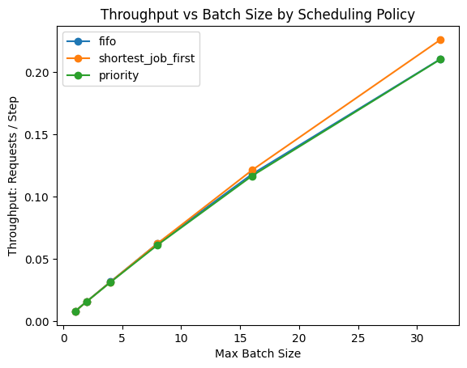
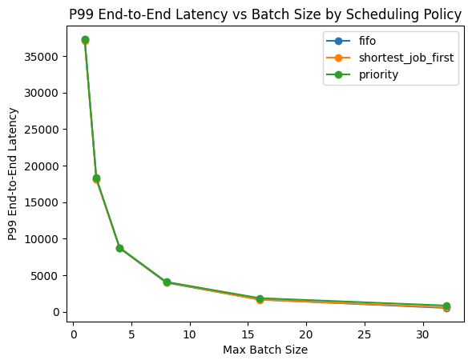
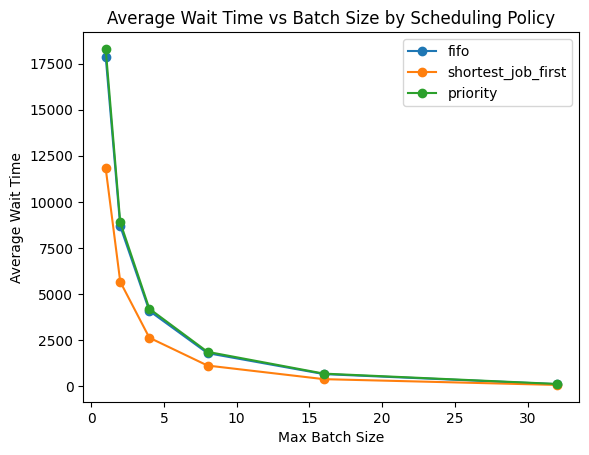
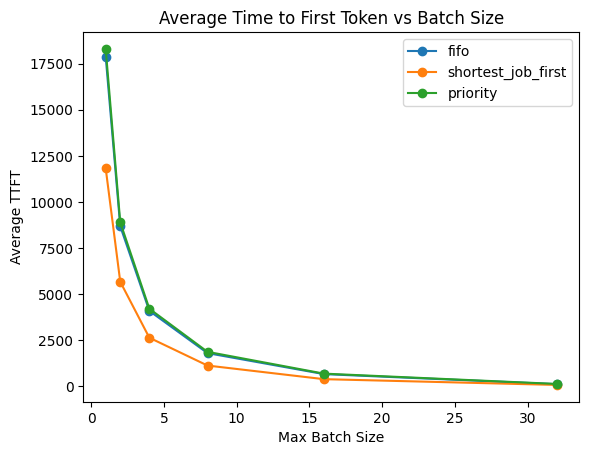
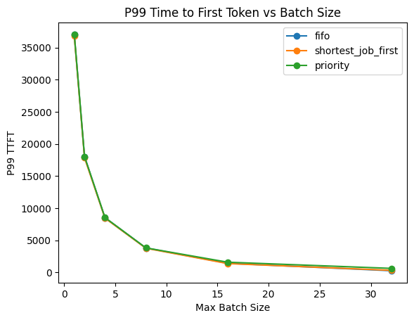
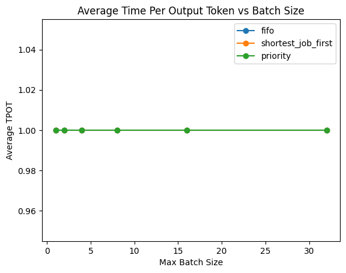
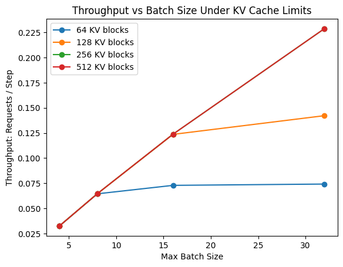
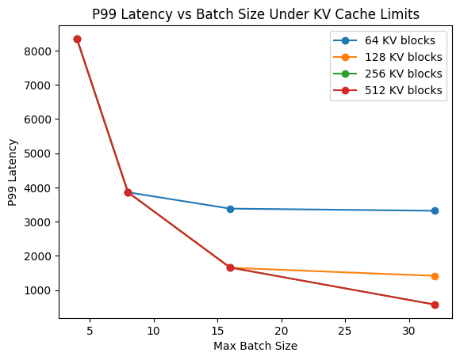
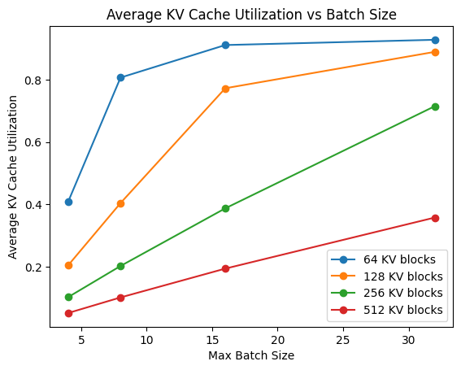
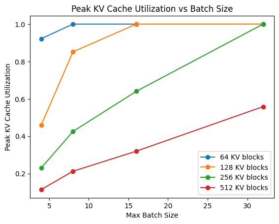

# LLM Serving Benchmarks

A systems-focused exploration of production LLM inference tradeoffs including:

* continuous batching
* scheduler policy
* throughput vs latency
* prefill vs decode behavior
* KV cache memory pressure
* TTFT (Time To First Token)
* TPOT (Time Per Output Token)

This project is inspired by production serving systems such as vLLM and explores the systems challenges involved in large-scale LLM inference.

---

# Why This Matters

LLM serving performance depends on:

* GPU utilization
* batching efficiency
* memory efficiency
* scheduler policy
* request fairness
* tail latency (p95 / p99)
* KV cache management

Modern serving systems like vLLM improve inference performance through:

* continuous batching
* efficient KV cache management
* dynamic scheduling
* paged KV allocation

This project builds intuition for those tradeoffs through simulation and visualization.

---

# Current Features

## Scheduler Simulator

Simulates:

* request arrival over time
* concurrent request execution
* dynamic batching
* scheduler policies

Supported scheduling policies:

* FIFO
* Shortest Job First
* Priority Scheduling

---

## Prefill vs Decode Modeling

The simulator separately models:

### Prefill Phase

* prompt processing
* TTFT impact
* prompt-length-dependent latency

### Decode Phase

* token-by-token generation
* TPOT impact
* sequential decode bottlenecks

This mirrors real-world LLM inference systems.

---

## KV Cache Memory Simulation

The simulator models:

* KV cache block allocation
* GPU memory pressure
* request admission constraints
* KV cache utilization
* concurrency limits imposed by memory

This simulates one of the central bottlenecks in production LLM serving systems:
GPU memory exhaustion caused by KV cache growth.

---

# Metrics Collected

The simulator tracks:

* Throughput
* End-to-end latency
* Average wait time
* P95 latency
* P99 latency
* TTFT (Time To First Token)
* TPOT (Time Per Output Token)
* Average KV cache utilization
* Peak KV cache utilization
* Request rejection / admission pressure

---

# Repository Structure

```text
src/
  scheduler_simulator.py
  plot_scheduler_results.py
  kv_cache_simulator.py
  plot_kv_cache_results.py

results/
  charts/
  scheduler_results.csv
  kv_cache_results.csv
```

---

# How To Run

## Install dependencies

```bash
pip install -r requirements.txt
```

## Run scheduler simulator

```bash
python src/scheduler_simulator.py
```

## Generate scheduler charts

```bash
python src/plot_scheduler_results.py
```

## Run KV cache simulator

```bash
python src/kv_cache_simulator.py
```

## Generate KV cache charts

```bash
python src/plot_kv_cache_results.py
```

Charts are generated under:

```text
results/charts/
```

---

# Experimental Findings

## 1. Larger batches improve throughput

Increasing batch size improves throughput because more requests are processed concurrently.

This mirrors production serving systems where continuous batching improves GPU utilization.

---

## 2. Aggressive batching can increase tail latency

Larger batches improve utilization but can negatively impact:

* p95 latency
* p99 latency
* fairness

This is one of the key tradeoffs in production inference systems.

---

## 3. Scheduling policy matters significantly

### FIFO

* simple and fair
* vulnerable to head-of-line blocking

### Shortest Job First

* improves average latency
* may starve large requests

### Priority Scheduling

* improves responsiveness for critical requests
* lower-priority requests may wait significantly longer

---

## 4. TTFT grows with prompt size

Longer prompts require more prefill work before generation can begin.

This reflects real-world inference behavior where long context windows increase:

* attention compute
* KV cache usage
* first-token latency

---

## 5. KV cache capacity directly limits concurrency

The KV cache simulation demonstrates that GPU memory becomes a hard upper bound on concurrent request execution.

As KV cache utilization approaches capacity:

* request admission becomes constrained
* wait times increase
* throughput gains diminish

This mirrors real-world serving systems where KV cache memory pressure is often the dominant serving bottleneck.

---

# Engineering Analysis & Learnings

## 1. Continuous batching improves throughput significantly

The simulator demonstrates that larger dynamic batches substantially improve request throughput because the serving system keeps compute resources utilized more consistently.

This mirrors real-world serving systems such as vLLM where continuous batching is one of the primary throughput optimizations.

Key insight:

* GPU utilization improves when idle gaps between requests are minimized.

However, maximizing throughput alone is insufficient because latency tradeoffs emerge quickly under bursty workloads.

---

## 2. Tail latency becomes the critical production challenge

As batch size increases:

* average throughput improves
* p95/p99 latency can worsen

This reflects one of the most important real-world serving tradeoffs:

```text
maximize utilization
vs
maintain low tail latency
```

In production environments, p99 latency often matters more than average latency because:

* user-facing responsiveness degrades
* timeout risk increases
* fairness issues emerge across workloads

This is particularly important for recommendation systems and interactive AI applications.

---

## 3. Scheduler policy has major impact on fairness and responsiveness

The simulator demonstrates that scheduler policy materially affects:

* wait time
* tail latency
* request fairness

### FIFO

FIFO scheduling is simple and fair but can suffer from head-of-line blocking where long-running requests delay smaller latency-sensitive requests.

### Shortest Job First

Shortest-job-first improves average latency and throughput efficiency for smaller requests.

However:

* large requests may experience starvation
* fairness degrades under skewed workloads

This mirrors tradeoffs seen in real serving systems where latency optimization can negatively impact workload fairness.

### Priority Scheduling

Priority scheduling improves responsiveness for critical workloads but introduces the possibility of sustained delays for lower-priority requests.

This resembles production scenarios where:

* premium traffic
* ranking workloads
* interactive requests

may receive preferential treatment over batch inference jobs.

---

## 4. Prefill and decode exhibit fundamentally different behavior

One of the most important learnings from this project is that prefill and decode phases behave very differently.

### Prefill

Prefill:

* processes the entire prompt
* scales with prompt length
* is more compute-heavy and parallelizable

Long prompts significantly increase TTFT because the model must process the entire context before generation begins.

### Decode

Decode:

* generates tokens sequentially
* is memory-bandwidth sensitive
* is harder to parallelize efficiently

This explains why decode often becomes the dominant bottleneck in production serving systems.

---

## 5. KV cache memory pressure is a first-class serving constraint

The KV cache simulation highlighted that memory management is just as important as compute scheduling in large-scale inference systems.

Even when compute capacity exists:

* requests may still be blocked due to KV cache exhaustion
* concurrency can collapse under large-context workloads
* memory pressure can dominate serving efficiency

This explains why systems such as vLLM introduced paged KV cache allocation mechanisms like PagedAttention.

---

## 6. Prompt tokens and generated tokens behave differently in KV cache growth

One important modeling insight from this project was understanding that:

* prompt token KV cache exists immediately after prefill
* generated tokens incrementally grow KV cache during decode

This distinction is important because decode-phase memory growth can progressively reduce concurrency over time.

This is one of the central scalability challenges in modern LLM serving systems.

---

## 7. Throughput optimization alone is not sufficient

An important systems insight from this project is that the “best” scheduler depends on workload characteristics.

Production serving systems must balance:

* throughput
* latency
* fairness
* memory pressure
* workload prioritization

This is why modern inference systems require sophisticated schedulers rather than static batching approaches.

---

## 8. Why vLLM-style systems matter

This project helped build intuition for why systems such as vLLM introduced:

* continuous batching
* dynamic scheduling
* efficient KV cache management
* paged KV allocation

Traditional static batching approaches leave significant compute capacity underutilized and struggle under heterogeneous workloads.

The simulator demonstrates how scheduler efficiency and memory efficiency become first-class concerns in large-scale inference serving systems.

---

# Example Charts

## Throughput by Scheduling Policy



---

## P99 Latency by Scheduling Policy



---

## Average Wait Time by Scheduling Policy



---

## Average TTFT by Scheduling Policy



---

## P99 TTFT by Scheduling Policy



---

## Average TPOT by Scheduling Policy



---

## KV Throughput vs Batch Size



---

## KV P99 Latency vs Batch Size



---

## Average KV Cache Utilization



---

## Peak KV Cache Utilization



---

# Future Improvements

Planned additions:

* unified serving simulator combining scheduling + KV cache growth
* KV cache paging simulation
* memory fragmentation modeling
* dynamic token-level scheduling
* speculative decoding simulation
* multi-tenant serving workloads
* long-context workload simulation
* decode prioritization policies
* realistic decode-phase KV cache growth

---

# Inspiration

This project is heavily inspired by:

* vLLM
* PagedAttention
* modern continuous batching inference systems
* large-scale production LLM serving architectures
